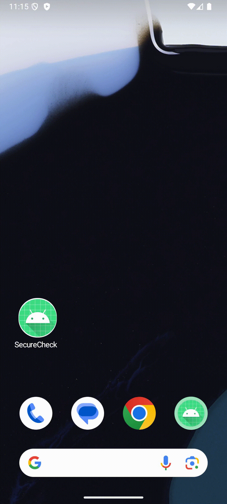
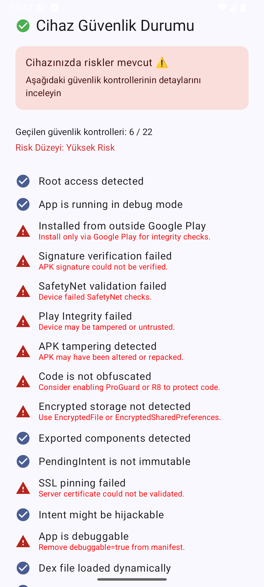

# SecureCheck

> **Modular Android Security Showcase** | MVVM + Clean Architecture + Dagger 2 + 25+ Production-grade security validation checks
> Implements real-world Android security strategies using structured architecture and modular design


SecureCheck is a modular, open-source Android application built to evaluate device and app integrity through over 25 runtime and system-level security checks, including Root, Debugger, Play Integrity, SafetyNet, SSL Pinning, and Frida/Xposed detection.

## Table of Contents

* [Features](#features)
* [Screenshots](#screenshots)
* [Setup & Run](#setup--run)
* [Architecture](#architecture)
* [Security Checks](#security-checks)
* [Testing & Debug](#testing--debug)
* [Project Structure](#project-structure)
* [Internationalization (i18n)](#internationalization-i18n)
* [Contribution](#contribution)
* [License](#license)
* [Türkçe Açıklama](#türkçe-açıklama)

---

## Features

| Check                    | Description                                                                              |
| ------------------------ | ---------------------------------------------------------------------------------------- |                              
| Root Detection           | Detect rooted devices                                                                    |
| Debugger Detection       | Checks debugger attachment                                                               |
| APK Signature            | Validates app signature via AES-encrypted hash comparison                                |
| Tamper Detection         | Detects APK repacking or build tampering                                                 |
| Obfuscation Check        | Ensures code is protected via ProGuard/R8                                                |
| Play Integrity API       | Uses official serverless API to verify genuine state                                     |
| SafetyNet Check          | Verifies CTS Profile & Basic Integrity                                                   |
| Exported Components      | Detects exported components in AndroidManifest                                           |
| PendingIntent Leak       | Detects unsafe FLAG\_MUTABLE usage                                                       |
| SSL Pinning              | Validates HTTPS via embedded certificate                                                 |
| Reflection Detection     | Analyzes reflection-prone class usage                                                    |
| Dex Loading              | Detects dynamically loaded `.dex` files at runtime                                       | 
| Frida/Xposed Detection   | Detects instrumentation frameworks                                                       |
| WebView Security         | Checks JS enable, file access, insecure JS interfaces                                    |
| Emulator/VPN/MockLoc     | Detects emulator, VPN usage, and mock location spoofing                                  |

All results are structured under a unified SecurityState model, which can be exported for audit or diagnostics.

---

<table>
  <tr>
    <th>MotionLayout Transition </th>
    <th>Security Summary</th>
  </tr>
  <tr>
    <td align="center">
      <br/>
      <sub><i>Shows animated transition using MotionLayout to visualize security results.</i></sub>
    </td>
    <td align="center">
      <br/>
      <sub><i>Displays a full scan result rendered on the summary screen.</i></sub>
    </td>
  </tr>
</table>

---

## Setup & Run

```bash
git clone https://github.com/muhammedalikocabey/securecheck.git
cd securecheck
./gradlew clean assembleDebug
```

Security checks are triggered automatically at app launch via `MainActivity.kt

---

## Architecture

**Architecture Pattern:** MVVM + Clean Architecture + DI via Dagger 2
[UI] → [ViewModel] → [UseCase] → [Detector/Checker] → [Result]

```
app/
├── core/           # Low-level modules (Frida, Root, SSL)
├── data/           # Validators, log exporter, secure storage
├── domain/         # UseCases, Interfaces, Models
├── presentation/   # Compose UI, ViewModel, MotionLayout
├── di/             # AppComponent, Modules
```

### Key Design Principles:

* One-way data propagation from UI to domain logic ensures traceable state management
* Decoupled layers: UI ↔ Domain ↔ Data ↔ Core
* Dependency injection through Dagger 2 modules and qualifiers

---

## Security Checks

Security checks are centralized in `CompositeCheckSecurityUseCase`. Each module is responsible for a single aspect (e.g., root, debugger, VPN):

- [SafetyNet Attestation](https://developer.android.com/training/safetynet/attestation)
- [Play Integrity API](https://developer.android.com/google/play/integrity)

```kotlin
SecurityState(
  isRooted = false,
  isDebuggerAttached = false,
  isSignatureValid = true,
  ... // +20 more
)
```

* Passed — Security check successful  
* Failed — Potential risk detected  
* Info — Suggestion provided in UI

Each check result is categorized as follows:

* Passed → Green icon
* Failed → Red warning + suggestion
* Suggestions from `strings.xml`

---

## Testing & Debug

* `FakeStateFactory`: preview safe/risky scenarios (debug builds only)
* `SecurityLogExporter`: JSON snapshot export of full SecurityState
* `SecureStorageManager`: tests EncryptedSharedPreferences + EncryptedFile
* Compose Previews available via `SecurityStatusScreenPreviewSafe()` in debug builds.

> Add `.crt` cert under `res/raw/securecheck_cert.crt` to test SSL pinning.

---

## Reporting

Each module produces a result that is consolidated into the SecurityState model, allowing the complete security status to be exported in structured JSON format.

The exported result format looks like this:
```json
{
  "isRooted": false,
  "isDebuggerAttached": false,
  "isFromPlayStore": true,
  "ctsProfileMatch": true,
  "basicIntegrity": true,
  "isGenuine": true,
  "riskLevel": "Safe",
  "overallSafe": true,
  "timestamp": 1715523375000
}
```

This enables sharing of scan results for compliance, audit, or bug analysis purposes.

A sample file is saved under:
```bash
/data/data/<your.package.name>/files/security_log.json
```
---

## Project Structure

```bash
core/
   ├── reverseanalysis/    # Frida, Xposed, Emulator
   ├── crypto/             # SecureCipher (AndroidKeyStore AES)
   ├── network/            # SSL Pinning, VPN detection
   ├── icc/                # Exported components, intent hijacking
   └── webview/            # WebView security analyzer

data/
   ├── detector/           # Impl classes (signature, root, etc.)
   ├── local/secure/       # Secure storage helpers
   └── log/                # Report exporter as JSON

domain/
   ├── usecase/            # All check use cases
   ├── model/              # SecurityState, WebViewSecurityResult
   └── extension/          # riskLevel, passedCheckCount helpers

presentation/
   ├── screen/security/    # ViewModel + Compose screen
   ├── common/base/        # BaseViewModel
   ├── common/state/       # UiState sealed class
   └── theme/              # Material3 + RiskColor provider
```

---

## Internationalization (i18n)

Multi-language support via:

* `values/strings.xml` (EN)
* `values-tr-rTR/strings.xml` (TR)

Example:

```xml
<string name="danger_frida">Frida instrumentation traces detected on the device.</string>
<string name="suggestion_frida">Frida may be active on device.</string>
```

---

## Contribution

Contributions are welcome via Pull Requests. Consider enhancing security modules, UI, or export features.

* New security modules (Magisk, dynamic analysis, SE-Linux)
* Snapshot encryption and remote sync (GitHub Actions, Firebase)
* UX optimization & performance enhancements
* UI test coverage for Compose screens

---

## Roadmap (V2 & Beyond)

> Target version: `v2.0.0` - Expected Q3 2025

Planned enhancements and extended detection modules for future releases:

### 🔐 Security Coverage Expansion
| Feature                                 | Description                                                                 |
|-----------------------------------------|-----------------------------------------------------------------------------|
| SELinux Enforcement Check             | Use `getenforce` command to verify SELinux mode (Enforcing / Permissive)   |
| Open Port Detection                   | Scan for unexpected open ports via `lsof` or `netstat`                      |
| App Sandbox Bypass Check              | Detect `run-as`, world-readable file leaks, or shared UID exploitation     |
| Native Layer Anti-Debugging          | Implement `ptrace`, `syscall`, and signal-based anti-debug detection       |
| Rootless / Magisk Bypass Detection    | Identify MagiskHide, Zygisk traces or root cloaking mechanisms             |
| BurpSuite / MITM Proxy Detection      | Check for custom CA injection, known proxy ports or Burp certificate       |

These features will be introduced under `core/advanced/` and integrated into `CompositeCheckSecurityUseCase` in version `v2.0.0`.

---

## License

```
MIT License

Copyright (c) 2025 Muhammed Ali Kocabey

Permission is hereby granted, free of charge, to any person obtaining a copy
of this software and associated documentation files (the "Software"), to deal
in the Software without restriction, including without limitation the rights
to use, copy, modify, merge, publish, distribute, sublicense, and/or sell
copies of the Software...
```

---

**Maintainer:** [Muhammed Ali Kocabey](https://github.com/muhammedalikocabey)  
[muhammedalikocabey.com](https://muhammedalikocabey.com)  
[Shaping the Future of Android – Spotify Podcast](https://open.spotify.com/show/7waAQAWmr2WIQNTlTJkkos)  
[Medium Articles](https://medium.com/@muhammedalikocabey)

---

## Türkçe Açıklama

### SecureCheck Nedir?

SecureCheck, Android cihazlarda root erişimi, debugger bağlantısı, sistem bütünlüğü ihlalleri ve tersine mühendislik girişimleri gibi güvenlik tehditlerini analiz etmek üzere tasarlanmış, açık kaynaklı ve modüler bir analiz uygulamasıdır.

Kurumsal güvenlik standartlarına uygun olarak tasarlanmıştır ve 25'ten fazla gerçek dünya güvenlik kontrolünü destekler.

### Öne Çıkan Özellikler

* Root, Debugger, Emulator, Frida, Xposed tespiti
* Play Integrity ve SafetyNet doğrulamaları
* APK imzası ve obfuscation (ProGuard/R8) kontrolleri
* SSL Pinning (.crt ile doğrulama)
* WebView JS güvenliği ve FLAG\_MUTABLE tespiti
* Compose + MotionLayout destekli modern UI
* Dagger 2 ile tam bağımlılık yönetimi
* MVVM + Clean Architecture yapısı

<h3>Ekran Görüntüleri</h3>

<table>
  <tr>
    <th>MotionLayout Geçişi</th>
    <th>Güvenlik Özeti</th>
  </tr>
  <tr>
    <td align="center">
      <br/>
      <sub><i>Güvenlik panelinin animasyonlu geçişi</i></sub>
    </td>
    <td align="center">
      <br/>
      <sub><i>Tüm kontrolleri gösteren statik ekran görüntüsü</i></sub>
    </td>
  </tr>
</table>

### Nasıl Çalışır?

Uygulama açıldığında `MainActivity.kt` içinde `SecurityViewModel` tetiklenir. ViewModel, `CompositeCheckSecurityUseCase` üzerinden tüm güvenlik kontrollerini sırayla yürütür ve sonuçları `SecurityState` modeline aktarır. UI katmanında bu bilgiler görselleştirilerek kullanıcıya sunulur.

### Kurulum ve Çalıştırma

```bash
git clone https://github.com/muhammedalikocabey/securecheck.git
cd securecheck
./gradlew clean assembleDebug
```

### Kod Mimarisi

Proje katmanları:

* `core/`: Düşük seviyeli dedektörler (Frida, VPN, Dex vs.)
* `data/`: Güvenlik veri sağlayıcıları ve log/export işlemleri
* `domain/`: UseCase, modeller ve core interface'ler
* `presentation/`: Compose ekranları, MotionLayout ve ViewModel
* `di/`: Dagger modül tanımlamaları

### Test ve Debug Özellikleri

* `FakeStateFactory`: Güvenli ve riskli örnek senaryoları simüle eder (sadece debug build)
* `SecurityLogExporter`: Tüm güvenlik durumu JSON formatında dışa aktarılır
* `SecureStorageManager`: EncryptedFile ve EncryptedSharedPreferences test edilir
* `.crt` sertifikası ile SSL Pinning doğrulaması yapılabilir (`res/raw/securecheck_cert.crt`)

### Raporlama

* Her modülün sonucu `SecurityState` yapısında merkezi şekilde toplanır ve JSON formatında dışa aktarılabilir.
* `AppIntegritySnapshot` ile JSON formatında dışa aktarılır
* UI'da MotionLayout geçişiyle animasyonlu gösterim sağlanır


```json
{
  "isRooted": false,
  "isDebuggerAttached": false,
  "isFromPlayStore": true,
  "ctsProfileMatch": true,
  "basicIntegrity": true,
  "isGenuine": true,
  "riskLevel": "Safe",
  "overallSafe": true,
  "timestamp": 1715523375000
}
```

### Katkı Sunmak

Projeye katkıda bulunmak için forkladıktan sonra PR (pull request) açabilirsiniz.

Memnuniyetle karşılanan katkılar:

* Yeni güvenlik kontrolleri (ör. Magisk, SELinux, dynamic analysis)
* MotionLayout veya UI iyileştirmeleri
* JSON raporlamada yeni alanlar
* Test kapsamı ve Compose UI testleri

### Yol Haritası (V2 & Sonrası)

Hedef Sürüm: v2.0.0 - Q3 2025

Gelecekteki versiyonlarda eklenmesi planlanan gelişmiş güvenlik kontrolleri:

| Özellik                                | Açıklama                                                                 |
|----------------------------------------|--------------------------------------------------------------------------|
| SELinux Durumu Kontrolü             | `getenforce` komutu ile Enforcing/Pemissive modu tespiti                 |
| Açık Port Tespiti                   | `lsof`, `netstat` gibi araçlarla beklenmeyen açık port analizi           |
| Sandbox Bypass Tespiti              | `run-as` komutu veya world-readable dosyalar ile izolasyon ihlali kontrolü |
| Native Katman Anti-Debugging        | `ptrace`, `syscall` gibi native düzeyde anti-debug teknikleri            |
| Magisk/Rootless Gizleme Tespiti     | MagiskHide, Zygisk gibi root gizleme mekanizmalarının izlerini tespit     |
| BurpSuite/MITM Proxy Tespiti        | CA injeksiyonu, proxy portları veya Burp sertifikası kontrolü             |

Bu kontroller `core/advanced/` altında tanımlanacak ve `CompositeCheckSecurityUseCase` içerisine entegre edilecektir (v2.0.0 itibarıyla).


### Lisans

MIT Lisansı altında açık kaynaklı olarak yayınlanmaktadır.

Geliştirici: [Muhammed Ali Kocabey](https://github.com/muhammedalikocabey)  
[muhammedalikocabey.com](https://muhammedalikocabey.com)  
[Shaping the Future of Android – Spotify Podcast](https://open.spotify.com/show/7waAQAWmr2WIQNTlTJkkos?si=7ee4f7c0487d40f0)
[Medium](https://medium.com/@muhammedalikocabey)
